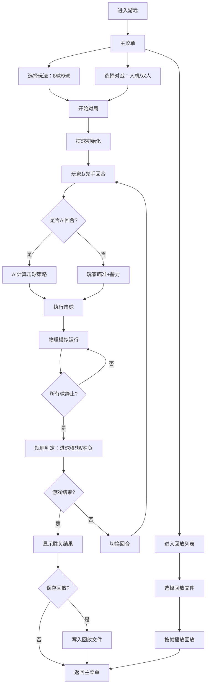

## 1. 产品概述
2D俯视角台球游戏，支持8球和9球两种主流玩法，提供真实物理模拟、AI对战和本地双人模式，具有瞄准辅助、犯规判定、计分系统和回放功能。
- 目标用户：台球爱好者、休闲游戏玩家
- 核心价值：在浏览器中提供接近真实的台球体验，无需安装即可游玩

## 2. 核心功能

### 2.1 游戏模式
| 模式 | 玩法描述 | 参与者 |
|------|---------|--------|
| 8球模式 | 15颗球，按花色(全色/半色)进球，最后打8号球 | 双人/人机 |
| 9球模式 | 9颗球，按数字顺序击球，最终打进9号球获胜 | 双人/人机 |

### 2.2 功能模块
1. **主菜单模块**：模式选择、难度选择、玩家模式选择、回放列表
2. **游戏场景模块**：台球桌渲染、球体渲染、物理模拟、碰撞检测
3. **交互控制模块**：鼠标瞄准、力量条调节、击球确认、轨迹预测线
4. **AI对战模块**：简单难度AI、困难难度AI（安全球策略）
5. **规则判定模块**：犯规判定、进球判定、胜负判定、回合切换
6. **计分UI模块**：比分显示、当前玩家指示、目标球提示、走位提示
7. **回放系统模块**：录制对局、保存回放文件、回放播放控制

### 2.3 页面详情
| 页面名称 | 模块名称 | 功能描述 |
|---------|---------|---------|
| 主菜单页 | 游戏标题 | 大气的游戏标题展示，台球桌背景动画 |
| 主菜单页 | 模式选择卡片 | 8球/9球选择卡片，带图标和说明 |
| 主菜单页 | 对战模式选择 | 人机对战/本地双人切换 |
| 主菜单页 | AI难度选择 | 简单/困难难度选择，带说明文字 |
| 主菜单页 | 回放入口 | 进入回放列表查看已保存对局 |
| 游戏对战页 | 台球桌画布 | Canvas渲染的2D俯视角台球桌 |
| 游戏对战页 | 瞄准系统 | 鼠标移动调整角度，虚线显示预测轨迹 |
| 游戏对战页 | 力量条 | 按住左键蓄力，松开击球，颜色渐变指示力度 |
| 游戏对战页 | 信息面板 | 当前玩家、比分、目标球提示、犯规提示 |
| 游戏对战页 | 控制按钮 | 暂停、重置、保存回放、返回菜单 |
| 回放页 | 回放列表 | 显示所有保存的对局文件，支持播放/删除 |
| 回放页 | 回放播放 | 进度条、播放/暂停、倍速、返回列表 |

## 3. 核心流程

## 4. 用户界面设计

### 4.1 设计风格
- **主色调**：深绿色（台呢色）#1a5f3c + 金色（球杆/装饰）#d4a84b + 深棕色（桌边）#3d2817
- **辅助色**：象牙白（白球）#f5f0e0 + 红/黄/蓝/紫/橙/绿（各色球）
- **按钮风格**：圆角矩形，金色边框，悬停时有发光效果，按下有回弹动画
- **字体**：标题使用 "Playfair Display"（优雅衬线体），正文使用 "Roboto"（现代无衬线）
- **布局风格**：游戏采用居中固定比例布局，侧边信息面板
- **视觉细节**：台呢纹理、球体高光渐变、桌边框立体感、阴影层次

### 4.2 页面设计概述
| 页面名称 | 模块名称 | UI元素 |
|---------|---------|--------|
| 主菜单页 | 背景 | 动态慢转的台球桌场景，球体轻微滚动 |
| 主菜单页 | 标题 | 大号金色艺术字"2D BILLIARDS"，带阴影 |
| 主菜单页 | 选择卡片 | 玻璃拟态卡片，悬停上浮+金色光晕 |
| 主菜单页 | 难度开关 | 滑动切换开关，选中项金色高亮 |
| 游戏对战页 | 台球桌 | 圆角矩形，绿色台呢+6个袋口+木质边框 |
| 游戏对战页 | 瞄准线 | 虚线白色轨迹线，白球到目标球实线，之后虚线 |
| 游戏对战页 | 力量条 | 右侧垂直条，底部蓄力，颜色绿→黄→红渐变 |
| 游戏对战页 | 信息栏 | 顶部半透明条，玩家图标+比分+目标球提示 |
| 游戏对战页 | 犯规提示 | 红色弹窗动画，文字说明犯规原因 |
| 回放页 | 列表项 | 卡片式，显示时间、模式、胜负结果、时长 |
| 回放页 | 控制栏 | 底部播放控制，进度条可拖动 |

### 4.3 响应式
- 桌面端优先设计，固定1280x720比例画布
- 平板/小屏：缩放画布适配，侧边面板改为上下布局
- 触屏支持：触摸拖动瞄准，触摸按钮蓄力
