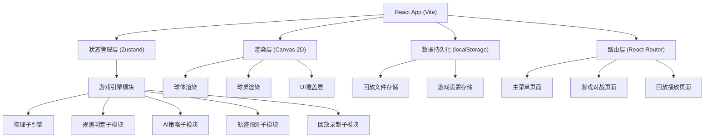
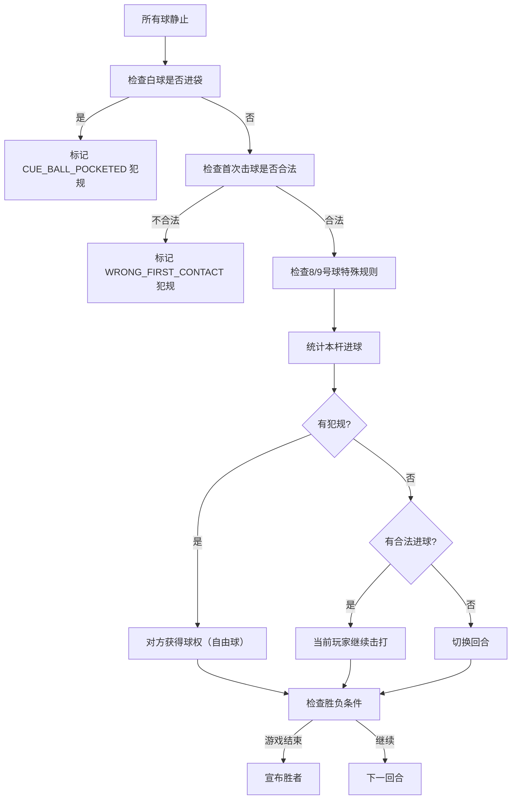

## 1. 架构设计



## 2. 技术描述
- **前端框架**: React@18 + TypeScript
- **构建工具**: Vite@5
- **状态管理**: Zustand（轻量级，适合游戏状态管理）
- **样式方案**: Tailwind CSS@3
- **路由**: React Router@6
- **渲染**: HTML5 Canvas 2D 原生API（无需额外2D物理库，自研物理引擎以获得完全控制）
- **存储**: localStorage（回放文件JSON序列化存储）
- **动画**: requestAnimationFrame 游戏循环

## 3. 目录结构与模块划分

```
src/
├── components/              # UI组件
│   ├── MainMenu.tsx         # 主菜单
│   ├── GameCanvas.tsx       # 游戏画布容器
│   ├── HUD.tsx              # 游戏内HUD信息面板
│   ├── PowerBar.tsx         # 力量条组件
│   ├── AimLine.tsx          # 瞄准辅助线逻辑（或内嵌Canvas）
│   ├── ReplayList.tsx       # 回放列表
│   ├── ReplayPlayer.tsx     # 回放播放器
│   └── ui/                  # 基础UI组件（按钮、卡片、开关）
├── game/                    # 游戏核心逻辑（与React解耦）
│   ├── types.ts             # 类型定义：Ball, Vec2, GameState等
│   ├── constants.ts         # 常量：球桌尺寸、球半径、摩擦系数等
│   ├── physics.ts           # 物理引擎：碰撞、摩擦、旋转
│   ├── rules.ts             # 规则引擎：8球/9球规则、犯规判定
│   ├── ai.ts                # AI策略：简单/困难难度
│   ├── prediction.ts        # 轨迹预测
│   ├── replay.ts            # 回放录制与序列化
│   └── table-setup.ts       # 摆球初始化
├── stores/                  # Zustand状态
│   └── useGameStore.ts      # 全局游戏状态store
├── pages/                   # 路由页面
│   ├── MenuPage.tsx
│   ├── GamePage.tsx
│   └── ReplayPage.tsx
├── utils/                   # 工具函数
│   ├── math.ts              # 向量运算工具
│   └── storage.ts           # localStorage封装
├── styles/                  # 全局样式
│   └── index.css
├── App.tsx
├── main.tsx
└── vite-env.d.ts
```

## 4. 核心数据模型定义

```typescript
// 向量
interface Vec2 {
  x: number;
  y: number;
}

// 球
interface Ball {
  id: number;              // 0=白球, 1-15编号球
  pos: Vec2;
  vel: Vec2;
  acc: Vec2;
  radius: number;
  color: string;
  stripe: boolean;         // 是否半色(条纹)球
  pocketed: boolean;       // 是否进袋
  pocketedAt: number | null;
  spin: Vec2;              // 旋转向量 (用于简化的旋转模拟)
}

// 球桌袋口
interface Pocket {
  pos: Vec2;
  radius: number;
}

// 击中记录（用于犯规判定）
interface HitRecord {
  ballId: number;
  timestamp: number;
}

// 击球动作
interface Shot {
  aimAngle: number;        // 瞄准角度(弧度)
  power: number;           // 力度 0-1
  playerId: number;
  timestamp: number;
  hits: HitRecord[];       // 本杆击中序列
  pocketedBalls: number[]; // 本杆进球
  foul: FoulType | null;   // 本杆是否犯规
}

// 犯规类型
enum FoulType {
  NONE = 'NONE',
  CUE_BALL_POCKETED = 'CUE_BALL_POCKETED',     // 白球落袋
  WRONG_FIRST_CONTACT = 'WRONG_FIRST_CONTACT', // 先触非目标球
  NO_BALL_HIT = 'NO_BALL_HIT',                 // 未击中任何球
  EIGHT_BALL_POCKETED_EARLY = 'EIGHT_BALL_POCKETED_EARLY', // 8号球提前进
  NO_RAIL_AFTER_HIT = 'NO_RAIL_AFTER_HIT',     // 击后无球碰库（部分规则）
}

// 玩家
interface Player {
  id: number;
  name: string;
  isAI: boolean;
  aiDifficulty?: 'easy' | 'hard';
  group?: 'solid' | 'stripe' | null;  // 8球中分配的花色
  score: number;
}

// 游戏模式
type GameMode = '8ball' | '9ball';
type PlayMode = 'pvp' | 'pve';

// 游戏状态
type GamePhase = 'setup' | 'aiming' | 'charging' | 'shooting' | 'simulating' | 'resolving' | 'gameover';

interface GameState {
  mode: GameMode;
  playMode: PlayMode;
  phase: GamePhase;
  balls: Ball[];
  currentPlayerId: number;
  players: Player[];
  currentShot: Shot | null;
  shotHistory: Shot[];
  foul: FoulType | null;
  winner: Player | null;
  turnNumber: number;
  targetBallHint: string | null;  // 走位/目标球提示文字
  replayRecording: boolean;
}

// 回放文件结构
interface ReplayFile {
  id: string;
  timestamp: number;
  duration: number;
  mode: GameMode;
  players: Player[];
  winner: Player | null;
  initialBalls: Ball[];           // 初始摆球
  shots: Shot[];                  // 每杆数据（含每帧球状态增量，或完整帧快照）
  frames: ReplayFrame[];          // 关键帧快照（用于加速回放）
}

interface ReplayFrame {
  frameIndex: number;
  balls: Ball[];
  phase: GamePhase;
  currentPlayerId: number;
}
```

## 5. 核心算法说明

### 5.1 物理引擎
- **时间步进**: 固定时间步长 `dt = 1/60s`，使用子步长细分以避免穿透
- **摩擦衰减**: `vel *= friction^dt`，其中 `friction ≈ 0.995` 每帧
- **球-球碰撞**: 圆对圆弹性碰撞，使用动量守恒公式，沿法线方向分解速度
- **球-库边碰撞**: 检测球心到桌沿的距离，反向法线分量速度并乘以恢复系数 `e ≈ 0.92`
- **袋口检测**: 球心进入袋口半径范围内标记为进袋，从物理模拟中移除
- **旋转简化**: 使用旋转向量影响摩擦力方向，产生轻微弧线（塞球效果）

### 5.2 轨迹预测
- 从白球位置沿瞄准方向发射虚拟球
- 模拟与第一颗目标球的碰撞，计算分离角
- 用虚线绘制：白球→目标球（实线），目标球去向（虚线），白球反弹去向（虚线）
- 不模拟多次碰撞以保持性能

### 5.3 AI策略
- **简单AI**: 随机选择一颗合法目标球，随机力度(0.4-0.8)，角度偏差±5°
- **困难AI**:
  1. 枚举所有合法目标球
  2. 对每颗球计算进袋角度和所需速度
  3. 评估进球概率（考虑距离、角度、障碍）
  4. 若无高概率进球（<30%），选择安全球策略：将白球停在难打的位置
  5. 使用几何法计算薄球/厚球击打角度，加入轻微扰动

### 5.4 规则判定流程

